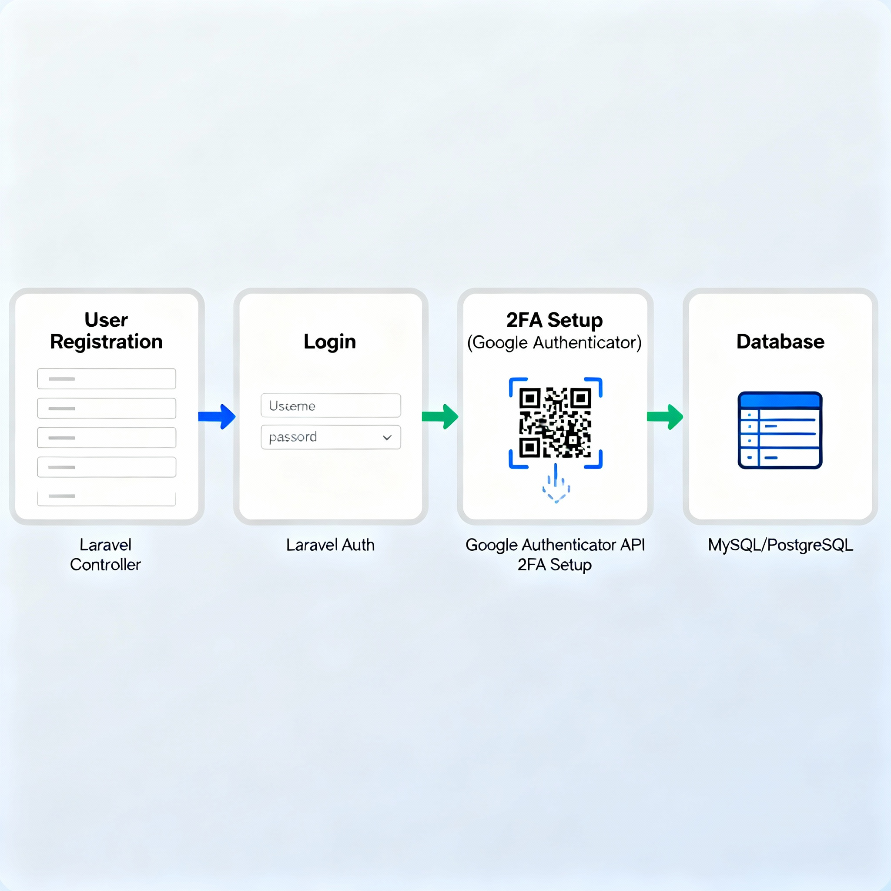

Here’s a **complete, unified README.md** for Printo project (multi-repo setup, backend with PostgreSQL via Docker, full instructions, architecture, endpoints, testing, and contact info):

***

# 🖨️ Printo – Collaborative Printing Platform

## 🚀 Overview

**Printo** is a modern, secure printing collaboration platform designed to manage users, authentication (with 2FA).

This implementation runs as a **multi-repo**:  
- 🖥️ **Frontend:** [printo-frontend](https://github.com/SaiVinay023/printo-frontend) – React + Vite SPA  
- ⚙️ **Backend:** [printo-backend](https://github.com/SaiVinay023/printo-backend) – Laravel REST API

**Why multi-repo?**  
Separation of concerns, independent development/deployment, clean security boundaries, and flexibility for future scaling or microservices.

***

## 🛠️ Tech Stack

| Layer      | Technology                                         |
|------------|----------------------------------------------------|
| Frontend   | React 18.x, Vite 4.x, JavaScript, CSS              |
| Backend    | Laravel 10.x, PHP 8.x, Composer                    |
| Database   | PostgreSQL (Docker for local dev)                  |
| Auth/2FA   | JWT (Laravel Sanctum), PragmaRX Google2FA, BaconQrCode |
| Testing    | PHPUnit (backend), postman, curl |
| Deployment | Vercel (frontend), Render (backend)    |
| Dev Tools  | ESLint, Prettier, GitHub Actions                   |

***

🚀 User Flow Overview
Home: User sees branding and chooses either "Register" or "Login".

Register: User completes a profile form, submits info to backend.

Login: User enters email & password; if 2FA is required, proceeds accordingly.

2FA Setup: If needed, user is shown a QR code to scan and add to Google Authenticator.

2FA Verification: User enters current 6-digit code from authenticator app.

Profile Page: On success, user sees protected demographic info.

Logout: User can log out, which ends the protected session.




## 🏗️ Architecture & Folder Structure

**Multi-Repo Structure:**

```
printo-backend/
├── app/                # Controllers, Models
├── config/
├── database/
│   ├── migrations/
│   └── seeders/
├── routes/
│   └── api.php
├── tests/
├── .env.example
└── composer.json

printo-frontend/
├── public/
├── src/
│   ├── api/
│   ├── components/
│   ├── pages/
│   ├── App.jsx
│   └── main.jsx
├── .env.example
├── package.json
└── vite.config.js
```

**Implementation Flow:**
1. User registers (frontend → `/api/register`)
2. Frontend prompts for 2FA setup (backend → `/api/setup-2fa`)
3. User scans QR, submits OTP (frontend → `/api/verify-2fa`)
4. On verification, receives JWT and can access secure endpoints (`/api/profile`)
5. Profile and advanced features exposed conditionally based on authentication/2FA state

***

## 🗄️ Run Local Database with Docker

```bash
docker run -d \
  --name printo-postgres \
  -e POSTGRES_DB=laraveldb \
  -e POSTGRES_USER=laraveluser \
  -e POSTGRES_PASSWORD=secret \
  -p 5432:5432 \
  postgres:15
```
**Docker exposes Postgres at `localhost:5432` for your Laravel backend.**

***

## 🧑‍💻 Installation & Local Setup

### 1. **Clone Both Repos**
```bash
git clone https://github.com/SaiVinay023/printo-frontend.git
git clone https://github.com/SaiVinay023/printo-backend.git
```

### 2. **Backend Setup**
```bash
cd printo-backend
cp .env.example .env            # Set DB config to match Docker above
composer install
php artisan key:generate
php artisan migrate             # Creates necessary tables
php artisan serve               # API at http://localhost:8000
```

### 3. **Frontend Setup**
```bash
cd printo-frontend
cp .env.example .env            # Set VITE_API_URL=http://localhost:8000/api
npm install
npm run dev                     # Runs frontend at http://localhost:5173
```

***

## ⚙️ Environment Variables

### Backend (`.env`)
```
DB_CONNECTION=pgsql
DB_HOST=127.0.0.1
DB_PORT=5432
DB_DATABASE=laraveldb
DB_USERNAME=laraveluser
DB_PASSWORD=secret
```

### Frontend (`.env`)
```
VITE_API_URL=http://localhost:8000/api
```

***

## 📚 API Endpoints

| Method | Endpoint            | Purpose                                   |
|--------|---------------------|-------------------------------------------|
| POST   | /api/register       | User registration                         |
| POST   | /api/login          | Login, triggers 2FA                       |
| POST   | /api/setup-2fa      | Enroll 2FA, returns QR and secret         |
| POST   | /api/verify-2fa     | Validate OTP, receive JWT                 |
| GET    | /api/profile        | Authenticated user info                   |

**Example request/response:**

- **Register**
  ```json
  POST /api/register
  {
    "name": "Vinay", "email": "...", "password": "...", ...
  }
  → { "user_id": 1, "message": "User registered", ... }
  ```

- **Setup 2FA**
  ```json
  POST /api/setup-2fa
  (Headers: Bearer access_token)
  → { "qr": "...", "secret": "...", "user_id": 1 }
  ```

- **Verify 2FA**
  ```json
  POST /api/verify-2fa
  { "user_id": 1, "code": "123456" }
  → { "access_token": "..." }
  ```

- **Profile**
  ```json
  GET /api/profile
  (Headers: Bearer access_token)
  → { ...demographic info... }
  ```

***

## 🔬 Backend Testing

Run the backend test suite:
```bash
php artisan test
```
Covers key features: registration, login, 2FA setup/verify, profile access.

***

## 🧪 Frontend Testing (Optional)

If using Jest/Cypress:
```bash
npm run test
npx cypress open
```

***

## 🚀 Deployment

- **Frontend:** Deploy on Vercel, Netlify, or Render. Connect repo, set API URL.
- **Backend:** Deploy on AWS, Render, DigitalOcean. Ensure Postgres production DB and `.env` are set.

***

## 🤝 Contributing

- Fork both repos
- Create feature branches
- Open PR with detailed description and tests

***

## ⚖️ License

MIT License © SaiVinay023

***

## 👤 Author / Contact

**Sai Vinay**  
- [LinkedIn](https://linkedin.com/in/saivinay023)  
- [GitHub](https://github.com/SaiVinay023)  
- Email: youremail@example.com

***

## 🗂️ Why Two Repositories?

- **Separation of concerns:** Clean separation between UI/UX (frontend) and API/data/business logic (backend)
- **Scalability:** Enables independent releases, microservice migration, and flexible scaling
- **Security:** Backend and database code/config are not publicly exposed
- **Collaboration:** Backend and frontend teams work independently with separate CI/CD pipelines


